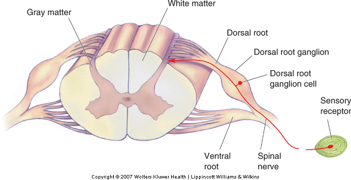

# Somatosensory System
## Dorsal Root Ganglion Bullshit

## Questions for Mark
### EPSP, GeP, GrP
> My guy, Excitatory Postsynaptic Potential, Generator Potential, and Graded Potential.
>
> What is the difference?

| Potential                         | Current Understanding |
|-----------------------------------|--|
| Depolarising Graded Potential     | An excitatory stimulation of the Plasma Membrane, but not enough to reach Threshold |
| Generator Potential               | A Depolarising Gradient Potential on a Primary Sensory Neuron                       |
| Excitatory Postsynaptic Potential | A Depolarising Gradient Potential on the Postsynaptic Membrane of a Neuron          |
